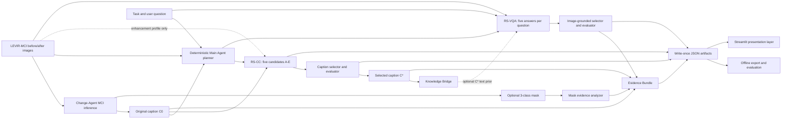

# RS-Agent 项目架构与论文方法对应说明

## 1. 结论摘要

RS-Agent 已从原始 Change-Agent/Lagent 演示代码中拆分为一个独立、可测试、可审计的研究流水线。当前实现能够在方法逻辑上对应论文的主流程：Change-Agent 生成一条原始变化描述，RS-CC 生成五个候选描述，独立 Judge 选择并评分得到 `C*`，Knowledge Bridge 只传递 `C*`，RS-VQA 使用原始双时相图像回答预设或用户问题，mask 仅作为可选证据，最后保留候选级和结果级评估记录。

当前可以称为“论文方法的工程复现与可扩展实现”，但不能把使用替代 API 模型和 20 个样本得到的数值称为论文正式实验结果复现。完整数值复现仍需要论文原模型、正式样本规模和与论文一致的指标协议。

## 2. 论文方法对应关系

| 论文方法要素 | 当前实现 | 对应状态 |
| --- | --- | --- |
| 一对图像对应一条原始变化描述 | Change-Agent MCI checkpoint 生成 `original_caption` | 已对应，并在 100 个 LEVIR-MCI 测试样本上重新生成和版本化 |
| CC-Agent 基于原始文本产生候选描述 | `RSCCAgent` 并发生成 A-E 五个候选；paper profile 全部为 `text_only` | 已对应 |
| 五个候选模型 | 配置中固定五个 generator 角色，候选模型、provider、输入模式均写入 artifact | 已对应，可替换模型但不会静默替换 |
| LLM-as-Judge 选择与评分 | 独立 selector 选择标签，独立 evaluator 给 A-E 打 1-10 分；最终按得分和选择规则确定 `C*` | 已对应 `elvaluation/TextAgent-LLMasJudge.py` 的核心逻辑 |
| Knowledge Bridge | 仅传递最终 `C*` 与来源 artifact，不传递被拒绝候选 | 已对应 |
| VQA-Agent 与 CC-Agent 使用不同模型组 | RS-CC 和 RS-VQA 使用独立配置、独立 provider registry 和独立候选模型列表 | 已对应 |
| VQA 视觉输入 | 每个 VQA 候选只接收原始 before/after 两幅图像 | 已对应；mask 不进入 VLM 消息 |
| 系统问题与用户问题 | 无用户问题时使用预设模板；有用户问题时支持用户问题或混合模式 | 已实现，问题模板为本项目重新设计 |
| mask | 独立解析变化比例、类别、连通区域和包围框 | 工程增强；始终是可选证据，不是基础输入 |
| 评估模块 | 候选账本、Judge 分数、BLEU、ROUGE-L、change flag、Bootstrap CI、成对消融 | 已保留并增强 |

### 必须明确的实验边界

1. 论文基线中的 RS-CC 是纯文本路径，只读取 Change-Agent 生成的原始描述；它不读取图像。
2. `image_text` RS-CC 是额外增强实验。只有显式配置为该模式且支持多图输入的模型才接收原始图像对和参考文本。
3. RS-VQA 的视觉输入始终只有原始双时相图像。`C*` 作为可选文本先验，mask 由独立证据模块处理。
4. Evidence Bundle、Streamlit 页面、候选 replay 和会话追问复用属于工程增强，不应混入论文基线结果。
5. `paper`、`operational`、`enhancement` 三类协议写入配置和实验身份；替代模型的结果不能标记为论文原模型复现。

## 3. 总体架构



### 分层职责

| 层 | 目录 | 职责 |
| --- | --- | --- |
| 应用入口 | `src/rs_agent/applications/` | 单样本、batch、preflight、export、Web 启动入口 |
| Web 展示 | `src/rs_agent/web/` | 输入校验、服务调用、候选账本、证据和交互问答 |
| 编排 | `src/rs_agent/orchestration/` | Main Agent、RS-CC/RS-VQA 流水线、Knowledge Bridge、Evidence Bundle |
| 遥感领域 | `src/rs_agent/domains/remote_sensing/` | 提示词、问题模板、图像输入、mask 和 LEVIR-MCI 适配 |
| 模型接入 | `src/rs_agent/providers/` | OpenRouter、SiliconFlow 等 OpenAI-compatible API 与网络预检 |
| 实验系统 | `src/rs_agent/experiments/` | 实验身份、可恢复状态、缓存、候选 replay |
| 评估 | `src/rs_agent/evaluation/` | LLM-as-Judge、参考指标、Bootstrap、消融比较和导出 |
| 核心 | `src/rs_agent/core/` | 强类型 schema、配置、哈希和不可变 artifact |
| 上游迁移参考 | `legacy/` | Change-Agent/Lagent 原代码的精选快照，不作为新核心依赖 |

Lagent 不再作为核心运行时。当前任务需要的是固定研究协议、并发 API 调用、严格实验身份和离线评估，而不是开放式工具调用，因此独立服务入口的改动量更小、可复现性更强。未来医学影响分析只需要新增领域包和配置，不需要把业务逻辑重新嵌入 Lagent。

## 4. 运行路径

### Caption

`C0 -> 五个 RS-CC 候选 -> selector/evaluator -> C* -> artifact`

### VQA with Knowledge Bridge

`C0 -> RS-CC -> C* -> 原始图像对 + 问题 + C* -> 五个 VQA 答案 -> Judge`

### VQA without Knowledge Bridge

`原始图像对 + 问题 -> 五个 VQA 答案 -> Judge`

该路径是真正跳过 RS-CC 的消融，不会生成一个空的或伪造的 `C*`。

### Combined

一次执行 Caption 与 VQA，并将所有候选、选择、评分、mask 证据和冲突记录到同一结果链中。

### Web follow-up

首次运行正常产生带来源的 `C*`。后续问题复用同一 `C*` 和来源 artifact，只重新执行 RS-VQA，避免重复生成 RS-CC 候选和会话知识漂移。复用路径会在 Main Agent plan 与 Evidence Bundle 中显式标记。

## 5. 数据与 artifact 约束

每个科学结果均写为带 SHA-256 的 write-once JSON artifact。主要链路为：

```text
main_agent_plan
caption_candidates -> caption_evaluation -> rs_cc_result
vqa_candidates     -> vqa_evaluation     -> rs_vqa_result
mask_evidence
evidence_bundle
rs_agent_result
```

图像二进制不会写入结果 JSON，只保存路径语义、内容哈希和实际输入模式。`.env`、API key、代理配置不会进入 artifact、state、cache、export 或 Git 历史。可恢复 batch state 与不可变结果分开存放；导出前重新校验来源 artifact 的类型和 checksum。

## 6. 评估设计

当前评估保留论文的五候选 LLM-as-Judge 特色，并增加研究可审计性：

- 保存所有候选原文、失败、模型 ID、provider、输入模式、请求遥测和入选状态；
- selector 与 evaluator 是独立角色，避免只保存一个最终答案；
- 输出 BLEU-1、无平滑 sentence BLEU-4、best-reference ROUGE-L 和 change-flag accuracy；
- 对选中结果和候选模型报告 deterministic percentile-bootstrap 置信区间；
- 对相同样本执行 paired bootstrap 消融比较；
- 候选 replay 可冻结共同候选，只重生成改变输入条件的候选，隔离 API 随机性；
- 结果导出验证 state、artifact、输入清单和参考清单的 hash。

论文正式结果阶段仍建议补齐与原论文一致的 corpus-level BLEU、METEOR、ROUGE-L、CIDEr 等指标，并在完整测试集上运行。

## 7. Phase 10 验证结果

### Change-Agent 数据再生成

- GPU：NVIDIA RTX 4090；
- 样本：LEVIR-MCI test split 前 100 对；
- 结果：100 条 caption、100 张三类 mask、0 条空描述；
- JSONL SHA-256：`393d0f6a535380e8a8739d19e998c6dcdc6d2880a44b8865975db31d6f73636b`；
- checkpoint SHA-256：`34c6926342c40fdd6d50b43d50257cb46cb6b61763448de9ee551828a64b3eb9`；
- 与此前 100 条结果逐样本比较：caption 差异 0，mask 像素差异 0。

### 严格候选 replay 消融

在同一 20 个平衡样本上冻结 A/B 两个公共文本候选，只重新生成 C/D/E 三个混合图文候选。100 个候选中 40 个为 checksum 验证后的 replay，API 请求从原本每组 140 次降为 100 次，20/20 样本完成且无失败。

| 指标 | mixed - text baseline | 95% paired CI | 解释 |
| --- | ---: | ---: | --- |
| BLEU-1 | -0.0532 | [-0.0956, -0.0177] | 当前图文增强显著下降 |
| BLEU-4 | +0.0025 | [-0.0109, 0.0208] | 不能排除 0 |
| ROUGE-L | -0.0383 | [-0.0726, -0.0078] | 当前图文增强显著下降 |
| change flag | 0.0000 | [0.0000, 0.0000] | 两组均为 1.0 |
| Judge score | -0.3500 | [-0.7500, 0.0000] | 不支持默认替换基线 |

结论是：当前证据不支持把图文扩写设为 RS-CC 默认路径。它应继续作为按模型能力启用、需要提示词校准的 enhancement profile；论文 text-only 基线保持不变。

## 8. Streamlit Web Demo

Web Demo 已具备以下交互：

- 从版本化 manifest 选择样本，或上传 before/after 图像和可选 mask；
- 选择 paper、operational、adapted mixed profile；
- 运行 Caption、VQA 或 Combined；
- 开关 Knowledge Bridge，输入用户问题或使用系统模板；
- 查看原始图像、mask、`C*`、五候选 RS-CC 账本、完整 RS-VQA 账本、Judge 分数、证据冲突和 artifact；
- 基于上一轮 `C*` 进行低成本交互追问。

启动方式：

```bash
conda activate rs-agent
pip install --no-build-isolation -e ".[dev,evaluation,web]"
export RS_AGENT_REPO_ROOT=/path/to/RS-Agent
export RS_AGENT_DEMO_MANIFEST=/path/to/levir_mci_test_100_with_masks.jsonl
export RS_AGENT_WEB_WORKDIR=/path/to/web-work
rs-agent-web --server.address 127.0.0.1 --server.port 8501
```

远程使用时建议通过 SSH 端口转发访问本机监听端口。当前页面没有身份认证，不应直接绑定公网地址。

## 9. 记忆设计

正式论文实验不启用跨样本语义记忆，否则候选生成会受到运行顺序和历史样本影响，破坏独立同分布假设和可复现性。当前系统采用两种受控状态：

- Run memory：不可变 artifact、batch state 和 checksum，服务于恢复、审计和评估；
- Session memory：Streamlit 会话中保存当前样本、上一轮 `C*` 和追问上下文，不跨样本检索。

未来可以增加独立的 retrieval memory，为长期交互保存用户关注对象、领域术语和历史证据，但必须使用显式开关、独立协议标签和单独消融，不能混入 paper profile。

## 10. 迁移到医学等其他领域

建议保留 `core`、`providers`、`experiments`、`evaluation` 和 `orchestration`，新增 `src/rs_agent/domains/medical/`：

1. 将双时相遥感图像替换为检查前后或治疗前后影像适配器；
2. 替换变化描述提示词、问题模板、证据类型和冲突规则；
3. 将 mask analyzer 替换为病灶/器官分割证据适配器；
4. 保持候选生成、Judge、Knowledge Bridge、artifact 和评估接口不变；
5. 用领域配置注册模型，不修改 Main Agent 核心。

这种结构比继续改造 Lagent 的内部 Agent 类改动更小，也避免遥感 prompt 和数据规则渗入通用框架。

## 11. 当前限制与后续工作

1. 论文原模型组合受 API 可用性和服务器网络影响，尚未完成完整 paper-profile 数值复现；
2. 严格 replay 消融只有 20 个平衡样本，应扩展到 50-100 个分层样本并报告建筑、道路和混合变化子集；
3. 图文 RS-CC 需要按模型设计防伪变化、长度和可见证据约束，而不是统一启用；
4. 应增加独立或多 Judge 稳健性实验，检查模型家族偏好；
5. Web Demo 当前适合研究演示，不具备公网部署所需的认证、限流和任务队列；
6. 医学迁移前需要将 Evidence Bundle 中的遥感二值变化词法分类器替换为领域策略接口。

截至 Phase 10，论文主流水线、可恢复实验、候选级评估、严格消融、GPU 数据版本化和 Streamlit 演示均已形成可运行闭环。下一阶段重点不再是补齐基本框架，而是扩大正式实验规模、校准 Judge/提示词并补齐论文原模型条件。
