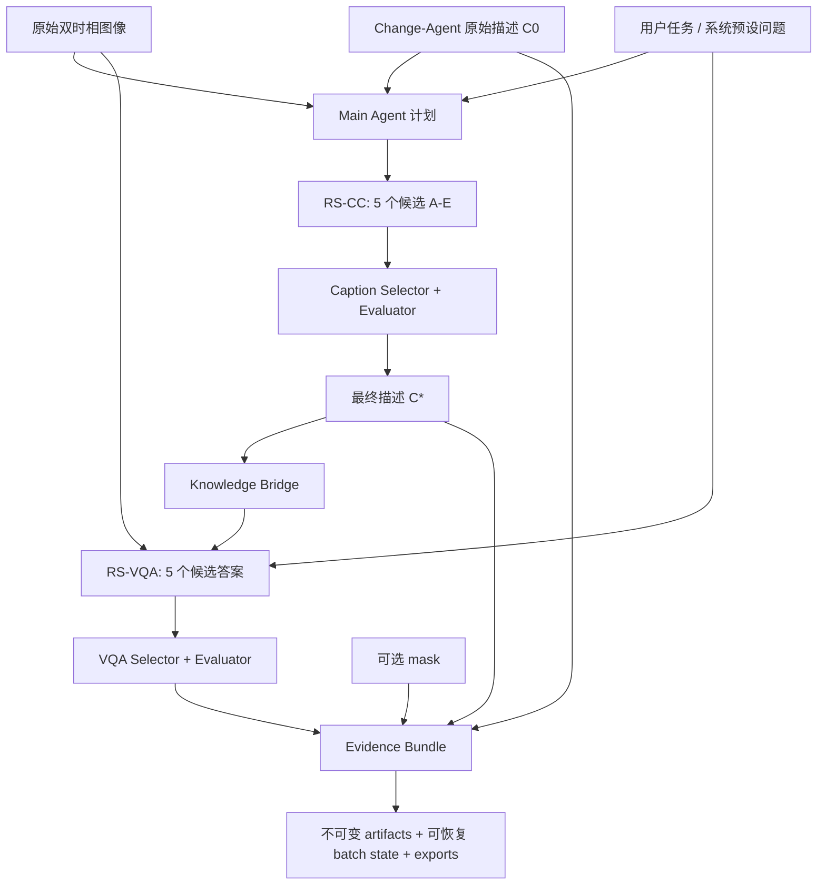

# RS-Agent 项目总览、论文对应关系与 Phase 11 状态

## 1. 结论

RS-Agent 已经形成独立、可运行、可恢复、可审计的遥感变化理解流水线。当前工程能够完成：

1. Change-Agent 为一对 LEVIR-MCI 双时相图像生成一条原始变化描述和可选 mask；
2. RS-CC 使用 5 个候选模型并发生成变化描述，由独立 Selector 和 Evaluator 选出 `C*`；
3. Knowledge Bridge 只传递带来源 artifact 的最终 `C*`；
4. RS-VQA 使用原始双时相图像、系统模板或用户问题，以及可选 `C*`，生成 5 个候选答案并再次 Judge；
5. mask 只进入证据层，不进入 VLM 消息；
6. Main Agent 负责任务规划，不额外引入论文未报告的答案融合模型；
7. 所有候选、评分、错误、遥测、模型身份和来源均保存为可校验 artifact；
8. Streamlit Demo 使用同一 application service，支持追问时严格复用 `C*`。

因此，当前系统可以称为“论文方法的工程复现与可扩展实现”。它仍不能称为“论文正式数值结果的完整复现”，因为论文原模型组合在当前服务器上存在区域限制或模型下线，并且 Phase 11 在线验证只有 5 条样本。

## 2. 论文中需要区分的两种 RS-CC 协议

论文的方法章节和正式实验脚本之间存在需要显式记录的差异。

### 2.1 论文方法章节

方法公式和文字叙述把 RS-CC 表示为：原始双时相图像、原始变化描述、提示和背景信息共同产生候选描述。按这一叙述，支持多图输入的 VLM 可以使用“原始图像对 + 参考描述”扩写或纠错。

当前对应配置：

```text
configs/rs_cc.method_image_text.yaml
```

该配置被标记为 `enhancement`，并且 `substitutes_paper_models: true`。它是对论文方法文字的能力感知实现，不冒充论文原模型实验。

### 2.2 论文正式实验脚本

论文正式实验以原 `elvaluation/TextAgent-LLMasJudge.py` 逻辑为准：5 个候选 LLM 只接收一条原始变化描述，GPT-4o 负责选择和 1–10 分评分。候选模型为 Claude Sonnet 4、DeepSeek V3、GPT-4o-mini、Qwen3-30B 和 LLaMA-4-Maverick。

当前对应配置：

```text
configs/rs_cc.paper.yaml
```

其方法标签为 `paper_experiment_text_only`，不会接收图像，也不会静默替换不可用模型。

这种双协议设计解决了“论文叙述支持图像，但正式 CC 实验代码只读文本”的偏差。以后报告结果时必须写明使用的是 `paper_experiment`、`paper_method interpretation` 还是 operational 配置。

## 3. 整体流水线



不同任务对应最小执行计划：

| 任务 | 执行阶段 |
| --- | --- |
| Caption | `rs_cc` |
| VQA + 新生成 `C*` | `rs_cc -> knowledge_bridge -> rs_vqa` |
| VQA + 已提供 `C*` | `knowledge_bridge -> rs_vqa` |
| VQA 无 KB 消融 | `rs_vqa` |
| Combined | `rs_cc -> knowledge_bridge -> rs_vqa` |
| 带 mask | 上述阶段外加独立 `mask_evidence` |

## 4. 项目架构

| 目录 | 职责 |
| --- | --- |
| `src/rs_agent/applications/` | 单样本、batch、preflight、export、Web CLI |
| `src/rs_agent/orchestration/` | Main Agent、RS-CC/RS-VQA pipeline、Knowledge Bridge、证据编排 |
| `src/rs_agent/domains/remote_sensing/` | 遥感提示词、问题模板、图像输入、mask 适配器和模型配置 |
| `src/rs_agent/providers/` | OpenAI-compatible API、重试、遥测、文本/双图真实能力探针 |
| `src/rs_agent/experiments/` | 实验身份、原子 state、cache、候选 replay、`C*` replay |
| `src/rs_agent/evaluation/` | LLM-as-Judge、论文式汇总、参考指标、盲评、嵌入和消融比较 |
| `src/rs_agent/web/` | Streamlit 输入校验、服务适配和结果视图 |
| `scripts/` | 数据生成、分层抽样、盲评、嵌入和比较入口 |
| `legacy/` | Change-Agent、Lagent 和旧评估代码快照，不是新核心依赖 |

Lagent 不再作为核心运行时。当前任务强调固定实验协议、并发 API、不可变 artifact 和离线评估，而不是开放式工具调用。保留独立 service 入口，使以后迁移到医学等领域时只需增加 domain package。

## 5. Agent 与记忆设计

### 5.1 当前 Agent 设计

- Main Agent 是确定性协调器，避免增加无法复现的额外 LLM 决策；
- RS-CC 和 RS-VQA 各有 5 个模型候选，可以独立失败，不会把失败记作 0 分；
- Selector 与 Evaluator 是独立角色；最终规则为最高分优先，平分时参考 Selector；
- Knowledge Bridge 只传 `C*`，不传 5 个候选，也不把 mask 注入 VLM；
- Evidence Bundle 保守记录冲突，不修改候选模型的原始输出。

### 5.2 当前记忆

- Run memory：write-once artifact、batch state、输入/config/source/runtime fingerprint；
- Session memory：Streamlit 当前样本、上一轮 `C*` 和其来源，追问只执行 RS-VQA；
- 跨样本 retrieval memory：论文实验默认关闭。

跨样本语义记忆会使结果依赖运行顺序和历史样本，破坏独立同分布假设，因此不能混入 paper profile。未来医学或长期交互版本可以增加显式开关的 retrieval memory，并使用独立协议标签和单独消融。

## 6. 评估系统

论文主评估已对应：

1. 保存 5 个候选和 LLM-as-Judge 1–10 分；
2. 按模型和变化类型导出均值与总体标准差；
3. 生成 A/B 随机化盲评试卷，答案密钥单独保存；
4. 使用 `Qwen/Qwen3-Embedding-0.6B` 计算 human-human 与 human-agent 余弦相似度；
5. 支持冻结候选后更换 Judge，比较选择一致率、Cohen's kappa、Pearson 和 MAE；
6. 支持严格 Knowledge Bridge 有/无成对比较和 bootstrap 区间。

补充自动指标包括 sentence BLEU-1/4、ROUGE-L、change-flag、corpus BLEU-1/4 和 CIDEr。它们用于工程诊断，不写成论文原有主指标。

主要导出：

```text
items.jsonl
caption_scores.csv
vqa_scores.csv
paper_benchmark_summary.csv
model_summary.csv
request_telemetry.csv
caption_reference_metrics.csv
caption_candidate_reference_metrics.csv
caption_candidate_summary.csv
caption_corpus_metrics.json
summary.json
experiment_identity.json
```

## 7. Phase 11 实际验证

### 7.1 50 条分层清单

来源为重新运行 Change-Agent 得到的 100 条描述和 mask。根据 LEVIR-MCI GT 标签的真实像素值分层，避免猜测类别语义：

| 分层 | 可用数 | 选中数 |
| --- | ---: | ---: |
| `no_change` | 62 | 22 |
| `class_128_only` | 1 | 1 |
| `class_255_only` | 26 | 16 |
| `mixed_change_labels` | 11 | 11 |

清单：

```text
/root/autodl-tmp/rs-agent-data/phase11-20260821/levir_mci_stratified_50.jsonl
SHA-256: c8747e4b28c93e0615dcdacd9dae7c7cb837641c517591d57f13929a31124a06
```

### 7.2 论文原模型可用性

新的 preflight 不只读取 `/models`，还按角色发送最小文本或双图 completion，并重试 429/5xx。

当前服务器可调用：DeepSeek-V3、Qwen3-30B、LLaMA-4-Maverick、MiniMax-01；Mistral 3.2 在本次最小双图 completion 探针中也返回 HTTP 200。

当前服务器不可完成论文原配置：

- Claude Sonnet 4、GPT-4o-mini、GPT-4o：OpenRouter completion HTTP 403；
- Qwen2.5-VL-32B：SiliconFlow 未列出且 completion HTTP 403。

因此 exact paper profile 被保留但不执行替换，结果不能伪装成论文原模型复现。

### 7.3 修复后的 5 条端到端 pilot

配置：5 个双图 RS-CC VLM + Qwen3-30B Caption Judge + 5 个 RS-VQA VLM + Qwen3-VL VQA Judge。

- 样本：5/5 completed，0 failed；
- RS-CC：25/25 候选成功；
- RS-VQA：25/25 候选成功；
- provider 请求：70；
- BLEU-1：0.1826；
- ROUGE-L：0.2016；
- change-flag accuracy：0.6；
- corpus BLEU-1：0.1377；
- CIDEr：0.0502。

这些数值只验证流程，不代表模型质量结论。5 条样本的区间很宽，且 4 条为 `no_change`。

首轮在线 pilot 中，Mistral 3.2 的双图请求返回 HTTP 400；本次收尾时的最小双图探针又返回 HTTP 200，说明其可用性可能受请求或上游路由影响。为使 operational/enhancement pilot 稳定，相关角色已替换为持续通过双图探针的 Qwen2.5-VL-72B；论文原配置不变。

### 7.4 Knowledge Bridge 消融

同一 5 条、同一问题模板、同一 VQA 配置：

- with-KB 遥测：35 条 `rs_vqa`，0 条 `rs_cc`；
- without-KB 遥测：35 条 `rs_vqa`，0 条 `rs_cc`；
- with-KB 计划：`knowledge_bridge -> rs_vqa`；
- Judge 分数差定义：with-KB minus without-KB；
- 平均差：+0.2；
- 95% bootstrap 区间：[-0.4, 0.8]；
- selected model agreement：0.6。

该 pilot 验证了严格复用，不支持“小样本下 KB 显著提高分数”的结论。

### 7.5 多 Judge replay

冻结同一 25 个 RS-CC 候选，只替换 Judge：

- replay 候选：25/25；
- 新候选生成请求：0；
- Judge 请求：10；
- Qwen3 与 DeepSeek 选择一致率：1.0；
- Cohen's kappa：1.0；
- 分数 Pearson：0.8581；
- 分数 MAE：0.92。

### 7.6 嵌入与盲评

Qwen3-Embedding-0.6B 的 5 条结果：

- mean human-agent similarity：0.5062；
- mean human-human similarity：0.6968。

已生成 5 条盲评试卷和独立答案密钥。尚未收集真实专家/学生评分，因此不能报告人工偏好率。

## 8. Streamlit Demo

Web Demo 支持：

- manifest 样本或 before/after 上传；
- Caption、VQA、Combined；
- paper experiment、paper method interpretation、adapted 和 operational profile；
- Knowledge Bridge、可选 mask、模板/用户问题；
- 5 候选账本、Judge 分数、`C*`、证据冲突和 artifact；
- provenance-linked `C*` 追问；
- 可选环境变量 `RS_AGENT_WEB_PASSWORD` 密码门禁。

密码门禁只解决轻量研究演示访问控制。公网产品仍需要反向代理、TLS、限流、任务队列和用户级配额。

## 9. 迁移到医学等领域

保留以下模块：

```text
core
providers
experiments
evaluation
orchestration
```

新增 `src/rs_agent/domains/medical/`，替换：

1. 前后检查或治疗前后影像适配器；
2. 医学描述提示、问题模板和证据类型；
3. 病灶/器官分割证据适配器；
4. 医学冲突规则和 Judge rubric；
5. 医学模型配置。

候选生成、Judge、Knowledge Bridge、artifact、batch 和评估接口不需要重写。这比继续修改 Lagent 内部 Agent 类的改动量更小。

## 10. 当前完成度与剩余边界

已完成：论文逻辑流水线、两种 CC 协议、RS-VQA、Main Agent、严格 `C*`、mask 证据、批处理、恢复、replay、模型能力预检、论文式评估、嵌入评估、盲评工具、多 Judge、KB 消融、Web Demo 和中文进展记录。

仍受外部条件限制：

1. 论文原模型在服务器上不能完整调用；
2. 论文正式数值复现需要完整正式样本规模；
3. 真实人工评价需要组织受试者；
4. Phase 11 在线 pilot 只有 5 条，不能用于显著性结论；
5. 长期 retrieval memory 有意不进入论文 profile；
6. 公网 Web 仍需队列、限流和部署基础设施。

这些边界属于后续正式实验或产品部署条件，不再是主流水线缺失。
